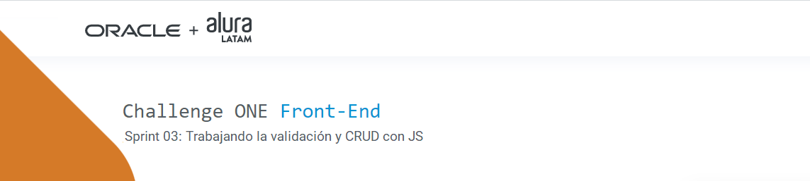
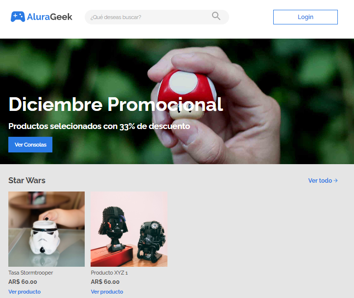

 
   
   
   

---

## Descripción
#### El objetivo de este cuarto challenge es poner en práctica los conceptos aprendidos sobre CRUD con JavaScript en la ruta Front-End del programa **ONE**.
---
## Funcionalidad
  
 - El proyecto consiste en un eCommerce, con todas las funcionalidades de un CRUD y validación de formularios.     
   

##### Se dejó de lado la "creatividad personal", para tratar de mostrar lo más fielmente posible el diseño proporcionado en **Figma**, con el objeto de simular las prácticas de trabajo de cualquier empresa del sector. 

&nbsp;

 

#### Marca este proyecto con una estrella ⭐

&nbsp;

### Puedes acceder al site, haciendo clic [**aquí**](https://Claubress.github.io/ONE-Alura-Challenge04/)
---
## Tecnologías utilizadas

---
## Autor
[ Claudio Bressan](https://github.com/Claubress) |
 :---: |

